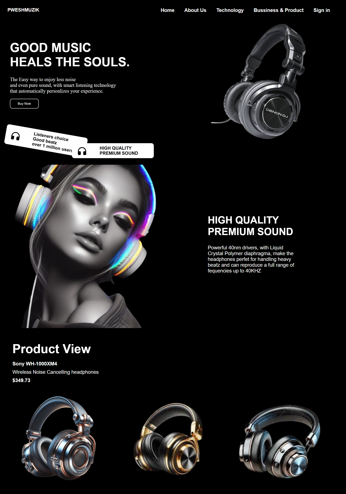

# 🎧 PWESHMUZIK

### GOOD MUSIC HEALS THE SOULS.

PWESHMUZIK is a modern, stylish landing page built to showcase high-quality headphones and music technology. 
It focuses on premium sound, aesthetics, and user experience with a dark, elegant design theme.

---

---

## 🖼️ Project Overview

This website highlights:
- **Premium headphone products**
- **Clean and futuristic design**
- **Modern UI with black background & white typography**
- **Product view section with pricing**
- **High-quality images for visual appeal**

---

## 🚀 Features

- Smooth typography & minimal design  
- Section highlights for:
  - Hero banner with tagline and CTA  
  - Technology & product details  
  - Premium product gallery  

---

## 🧩 Tech Stack

| Technology | Purpose |
|-------------|----------|
| HTML5 | Structure |
| CSS3 | Styling & animations |
| Font Awesome / Icons | Decorative icons |
| Google Fonts | Custom typography |

---

## 📸 Preview



---

## 📂 Folder Structure

```

PWESHMUZIK/
│
├── index.html
├── style.css
├── images/
│   ├── hero-headphones.png
│   ├── product1.png
│   ├── product2.png
│   └── product3.png
└── README.md

````

---

## ⚙️ How to Run

1. Clone the repository  
   ```bash
   git clone https://github.com/syntaxcoder13/headphone-website.git
```

2. Open the folder

   ```bash
   cd headphone-website
   ```
3. Run the project

   * Simply open `index.html` in your browser
   * Or use Live Server (VS Code extension)

---

**Developer:** SYNTAX CODER
💻 GitHub: [github.com/syntaxcoder13](https://github.com/syntaxcoder13)

---

### ⭐ If you like this project, give it a star on GitHub!

